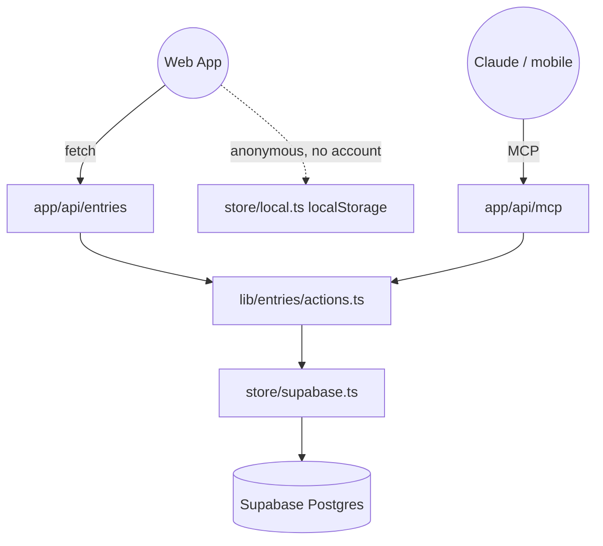

# 🧠 Thought Record — Specification Document

## 1. Overview

**Thought Record** is a personal CBT thought-record journal. It is the digital replacement for a therapy homework assignment: writing down a situation, the thoughts it triggered, the feelings that came with them, and the evidence for and against those thoughts.

It is built around two front ends over one shared core:

- A **web app** for writing and reviewing entries.
- An **MCP server** so entries can be written and reviewed conversationally from Claude (including Claude mobile), where the model doing the reasoning is the user's own Claude — not a model this project pays for.

The project is personal. Sign-up is open and anyone may use the public instance, but it is built for one user's needs and carries no support promise.

### 1.1 Design Principles

These constrain every feature decision in this document.

- **The tool must never be the reason an entry doesn't get written.** Capture is the bottleneck in paper thought records. Anything that slows down writing loses to a notes app.
- **An entry does not have to be finished in one sitting.** Testing a thought requires a calmer head than having it does. Entries can be saved incomplete and finished later. This is not a degraded state — it is the normal path.
- **The AI asks, it never concludes.** It may ask the Socratic questions from the worksheet ("what supports this thought? what contradicts it? what would you tell a friend who thought this?"). It must not decide whether a thought is true. The skill being built belongs to the user, and an AI that supplies conclusions prevents it from forming.
- **This is therapy material.** No analytics on entry content, no public demo mode seeded with real data, no logging of entry bodies. Every read path is scoped to one user.

### 1.2 The Four Columns

The standard CBT thought record (Greenberger & Padesky) has seven columns. The user's psychologist assigned a simplified four-column version after the first session. The UI shows four; the database stores all seven from day one, so raising the UI to seven later needs no migration and no backfilling of entries whose moment has passed.

| # | Column | In v1 UI | Field |
|---|---|---|---|
| 1 | Situation | yes | `situation` |
| 2 | Automatic thoughts | yes | `thoughts` |
| 3 | Feelings (+ intensity each) | yes | `feelings` (`[{name, intensity, valence?}]`) |
| 4 | Evidence for the thought | yes | `evidence_for` |
| 5 | Evidence against the thought | no | `evidence_against` |
| 6 | Balanced / alternative thought | no | `balanced_thought` |
| 7 | Feelings re-rated | no | `feeling_after`, `intensity_after` |

Column 4 as assigned is "is the thought consistent with reality" — a merge of the standard columns 4 and 5. v1 collects it as a single `evidence_for` field and leaves `evidence_against` free for when the split is introduced.

## 2. Core Features

### 2.1 Entry Capture (v1)

- Four-column form: situation, thoughts, feelings, evidence.
- **Free-text feelings.** No fixed emotion list and no normalisation column. Grouping "kesel" / "sebel" / "dongkol" is done at read time by Claude over the MCP path, not at write time by the user.
- **One intensity rating per feeling, 0–100.** A situation can bring several feelings at different strengths, so `feelings` is a list of `{name, intensity}`, up to 5. The intensity is its own integer, not embedded in the name. 0–100 rather than 0–10 to match the scale used in the standard worksheet. The list shows the strongest feeling's intensity; the plot shows every feeling as its own dot.
- **Optional valence per feeling.** `good` or `bad`, set only by the user (never inferred from the name), absent when not said. It lives inside the `feelings` jsonb, so it needs no migration, and the plot encodes it by shape, not colour.
- **Split timestamps.** `occurred_at` is when the situation happened; `created_at` is when the entry was written. Entries are frequently written hours later, and ordering by write time would misrepresent the record.
- **Draft or done.** An entry saved without column 4 is a `draft`. Drafts are listed separately so they can be finished later.

### 2.2 Review (v1)

- Chronological list of entries, newest first.
- Edit and delete any entry.
- Finish a draft: reopen it and fill in what was left blank.

### 2.3 Anonymous Mode (v1)

- The app is usable without an account; entries are stored in browser `localStorage`.
- **Deliberately web-only.** An MCP server runs server-side and has no access to browser storage, so anonymous data can never reach Claude. This is expected and accepted, not a limitation to work around.
- Intended for someone trying the app out. The primary user is always signed in.
- On sign-up, local entries are offered for import into the account.

### 2.4 MCP Server (v2)

Exposes the same actions the web app uses, as MCP tools:

- `add_entry` — create an entry from a conversation, complete or draft.
- `list_entries` — recent entries, filterable by status and date range.
- `get_drafts` — entries missing column 4, so Claude can offer to finish them.
- `update_entry` — fill in or correct fields on an existing entry.
- `delete_entry`.

No model is configured on this path and no system prompt ships with it. The tools are the whole surface; the reasoning belongs to whichever Claude the user is talking to.

**Authentication** is OAuth 2.1 with Supabase Auth as the authorization server, so the route works as a Claude custom connector (desktop and mobile). Claude registers itself dynamically, the user approves on `/oauth/consent`, and Claude sends the resulting Supabase access token as a bearer token. The route builds a Supabase client with that token, so RLS scopes every call to the user and no service-role key is involved. `/.well-known/oauth-protected-resource` points clients at Supabase; an unauthenticated request gets a 401 with `WWW-Authenticate` pointing there.

### 2.5 Psychologist Dashboard (v3)

A clean, self-contained read view built for showing to the psychologist at a session — not the raw database, and not the writing UI.

Likely served over a revocable read-only share link so it can be opened without an account. This needs a share-token table, deliberately deferred but noted so the schema can absorb it without rework.

### 2.6 Explicitly Out of Scope

Carried over as decisions, not oversights:

- **No Telegram bot.** The MCP path covers mobile capture.
- **No demo mode.** A feature whose purpose is letting strangers try the app is the wrong feature for a codebase holding therapy notes.
- **No per-tool rate limiting.** Every operation is a database read or write; there is no paid third-party API behind any of them.
- **No AI persona.** Any prompt written for this project starts from scratch. Nothing is adapted from the sibling `places-to-go` project, whose assistant is a roast master.
- **No streaks or gamification.** Missing a day should not generate guilt about therapy homework.

## 3. Tech Stack

### Frontend
- **Framework**: Next.js 16 (App Router)
- **Styling**: Tailwind CSS 4
- **UI Components**: Shadcn UI, Sonner
- **Data fetching**: TanStack Query

### Backend
- **Runtime**: Next.js Route Handlers
- **Database & Auth**: Supabase (Postgres + Auth, Row Level Security)
- **Validation**: Zod 4 — one schema per action, shared by HTTP routes and MCP tools
- **MCP**: `@modelcontextprotocol/sdk` (v2)

### Deployment
- **Hosting**: Vercel

### Lineage

Two existing projects are the reference, and neither is copied wholesale:

- `places-to-go` (Next + Vercel) — source of the MCP route shape and the single-registry pattern where one zod-schema'd tool definition serves several front ends.
- `money-tracker` (Astro + Netlify + Supabase) — source of the Supabase auth pattern. The Astro cookie API differs from Next's, so this is a pattern reference, not a code lift.

## 4. Architecture

The spine is a **shared action layer**. Entry operations are defined once, with zod schemas, outside any route handler. The web API and the MCP tools are both thin wrappers over it. When the MCP server is built in v2, the work is wrapping — not reimplementing logic that already lives in an API route.



Only the **client-side** storage has two implementations. Anonymous mode never reaches the server, so the server core stays Supabase-only rather than being made storage-agnostic — a thin client interface picks between calling the API and writing to `localStorage`.

## 5. Data Model

```sql
create table entries (
  id                uuid primary key default gen_random_uuid(),
  user_id           uuid not null references auth.users on delete cascade,

  occurred_at       timestamptz not null,  -- when the situation happened
  created_at        timestamptz not null default now(),
  updated_at        timestamptz not null default now(),

  -- columns 1-4, shown in v1
  situation         text not null,
  thoughts          text not null,
  feelings          jsonb not null,        -- [{name, intensity 0-100}], 1 to 5
  evidence_for      text,

  -- columns 5-7, stored from day one, surfaced later
  evidence_against  text,
  balanced_thought  text,
  feeling_after     text,
  intensity_after   int  check (intensity_after between 0 and 100),

  status            text not null default 'draft' check (status in ('draft','done'))
);
```

RLS: every policy on `entries` is scoped to `auth.uid() = user_id`. There is no shared read path and no service-role read of entry bodies.

## 6. Directory Structure

```
lib/entries/
  schema.ts        zod: CreateEntry, UpdateEntry, ListEntries
  actions.ts       createEntry(userId, input), listEntries(userId, filter), ...
  store/
    supabase.ts    server-side; the only module that touches the database
    local.ts       client-side localStorage, anonymous mode
lib/supabase/      client and server Supabase factories
app/api/entries/   thin route handlers over actions
app/api/mcp/       MCP tool wrappers over the same actions (v2)
app/(app)/         the writing and review UI
app/(auth)/        login, register, password reset
```

## 7. Configuration

- `NEXT_PUBLIC_SUPABASE_URL` — Supabase project URL.
- `NEXT_PUBLIC_SUPABASE_ANON_KEY` — Supabase anon key, used by the browser client under RLS.
- `CRON_SECRET` — Vercel sends it as a bearer token to `/api/cron/ping`, a daily no-op query that keeps the Supabase free-tier project from pausing.

## 8. Roadmap

- [ ] **v1 — Web app**: auth, four-column form with intensity, draft/done, chronological list, edit, delete, anonymous localStorage mode.
- [ ] **v2 — MCP server**: OAuth via Supabase Auth, consent page, tool wrappers over the action layer.
- [ ] **v3 — Psychologist dashboard**: read-only view, revocable share link, printable.
- [ ] **v4 — Seven columns**: surface columns 5–7 in the UI when the psychologist raises the exercise.
- [ ] **Import on sign-up**: migrate anonymous localStorage entries into a new account.

## 9. UI & Design Guidelines

### 9.1 The Governing Rule

**The only colour in the app is how strongly the user felt.**

Everything else — text, background, rules, buttons, navigation — is achromatic. Colour appears solely on the intensity value and its accompanying bar. This makes colour carry information rather than decoration: scrolling back through months of entries, the first thing the eye reads is the rise and fall of intensity, not chrome. It also makes the writing surface calm as a consequence of the rule rather than as a stated goal.

Nothing from the sibling `places-to-go` project's visual language carries over. Its glassmorphism and neon palette suit an app for picking somewhere to eat. This app is opened when the user feels bad, often late at night, and a bright energetic surface reads as tone-deaf in that moment.

### 9.2 Palette

The reference is the photocopied worksheet a psychologist hands over — cool grey paper, blue-black ink. Warm cream is deliberately avoided; it is the default every journalling app lands on.

| Token | Light | Dark |
|---|---|---|
| `paper` | `#EEF0F3` | `#14181F` |
| `surface` | `#F7F8FA` | `#1B212A` |
| `ink` | `#1B2028` | `#E6E9EE` |
| `ink-muted` | `#707A88` | `#8A94A3` |
| `rule` | `#D6DAE1` | `#2A313C` |
| `intensity` ramp | `#EADFC2` → `#8F5D14` | `#4A3F24` → `#E8B04A` |

The intensity ramp is a single hue — amber to bronze — varying in saturation and value, never shifting hue. A green-to-red ramp is rejected: it declares low intensity good and high intensity dangerous, judging the feeling before the user has examined it. Amber is pushed toward gold rather than clay; warm cream paired with terracotta clay is a widely recognisable generated-design signature.

The ramp direction inverts between themes: in light mode higher intensity is darker, in dark mode it is brighter. The rule is constant — higher intensity stands further off the paper.

One warm point on an otherwise cold page is also what keeps the interface from reading clinical. If it ever does read clinical, the fix is warming `surface`, not introducing colour elsewhere.

### 9.3 Typography

Two families, with the conventional roles inverted: **the user's writing is the display type and the app's own text recedes.**

- **Entry body** — a screen serif (Literata or Newsreader), 18–19px on mobile, generous line-height, measure under 70 characters. This is 95% of what appears on screen and should read as a person's voice, not as database content.
- **App chrome** — prompts, labels, dates, navigation: Geist (a neutral sans) at 13–14px in `ink-muted`.

Opening an old entry should fill the screen with the user's own voice, not with interface.

### 9.4 Layout

Single column, mobile-first.

**No cards.** Identical rounded cards turn each entry into a discrete object, when the thing being looked for on re-reading is the thread running between them. Entries are separated by hairline rules instead.

**No bordered textareas.** Each column is a question in the sans with the answer written directly beneath it, over a single thin baseline rule — writing on ruled paper rather than completing a form. The rule doubles as the field affordance and is the only surviving reference to the paper worksheet.

```
COMPOSER                          LIST
┌────────────────────────┐        ┌────────────────────────┐
│ Kemarin, 21.40      ⌄ │        │ Thought Record      + │
│                        │        ├────────────────────────┤
│ apa yang terjadi?      │        │ 30 Sep                 │
│ ───────────────────────│        │ Gue pasti dianggap     │
│ Dikoreksi di meeting   │        │ nggak becus            │
│ depan orang banyak     │        │ malu    ▓▓▓▓▓▓▓░░░ 70  │
│ ───────────────────────│        ├────────────────────────┤
│                        │        │ 28 Sep                 │
│ apa yang muncul di     │        │ Nggak ada yang bakal   │
│ pikiran?               │        │ nganggep ini penting   │
│ ───────────────────────│        │ cemas   ▓▓▓▓▓░░░░░ 50  │
│ Gue pasti dianggap     │        │ belum diuji            │
│ nggak becus            │        ├────────────────────────┤
│ ───────────────────────│        │ 26 Sep                 │
│                        │        │ Harusnya gue bisa      │
│ rasanya gimana?        │        │ lebih baik dari ini    │
│ ───────────────────────│        │ kecewa  ▓▓▓░░░░░░░ 30  │
│ malu, kesel sama diri  │        └────────────────────────┘
│ sendiri                │
│                        │
│  ──────●─────────  70  │
│                        │
│ apa buktinya?          │
│ ───────────────────────│
│ (kosong — draft)       │
│                        │
│         [ Simpan ]     │
└────────────────────────┘
```

### 9.5 Component Rules

- **List rows lead with the thought, not the situation.** Re-reading is a search for recurring thoughts; the situation is the wrapper and differs every time.
- **The intensity slider starts empty.** No default value — a pre-filled number anchors the answer before the user has considered it. It shows a dash until touched, and snaps in steps of 5; single-unit precision on a felt sense is false precision.
- **Drafts are marked with muted sans text** (`belum diuji`), never a coloured badge or a warning icon. A draft is the normal path through the app, not an error state.
- **There is no empty state screen.** With no entries, the app opens directly into the composer. A blank page ready to be written on invites more than an illustration with a button under it.

### 9.6 Voice

**UI copy is in Indonesian**, while this document and the code are in English. The user writes entries in Indonesian, and the four prompts should sound like their psychologist speaking rather than like product labels — `apa yang terjadi?`, not `Situasi`.

Lower case, conversational, no exclamation marks. Nothing congratulates the user for writing an entry and nothing remarks on how long it has been since the last one.

### 9.7 Motion

One moment only: when a draft's fourth column is filled in later, that section settles into place. Everything else is still — no per-section fade-and-slide on load, no hover transitions on list rows. `prefers-reduced-motion` is respected.

### 9.8 Quality Floor

- **Intensity is never encoded by colour alone.** The number is always present beside the bar, and the bar is also a length. This matters more than usual here, since colour appears nowhere else to establish a reading.
- Contrast meets WCAG AA in both themes, including the pale end of the intensity ramp against `paper`.
- Visible keyboard focus on every interactive element.
- Entry text inputs are at least 16px on mobile so iOS does not zoom on focus.
- Both themes are fully specified; neither is an afterthought inverted from the other.

<!-- BEGIN:nextjs-agent-rules -->

# This is NOT the Next.js you know

This version has breaking changes — APIs, conventions, and file structure may all differ from your training data. Read the relevant guide in `node_modules/next/dist/docs/` (resolved from this file's directory; in monorepos the `next` package may not be visible from the repo root) before writing any code. Heed deprecation notices.

This block is written and re-added by `next dev` — verify at `node_modules/next/dist/server/lib/generate-agent-files.js`. Removing it from a diff only re-creates the uncommitted change; committing it with your work keeps the tree clean.

<!-- END:nextjs-agent-rules -->
